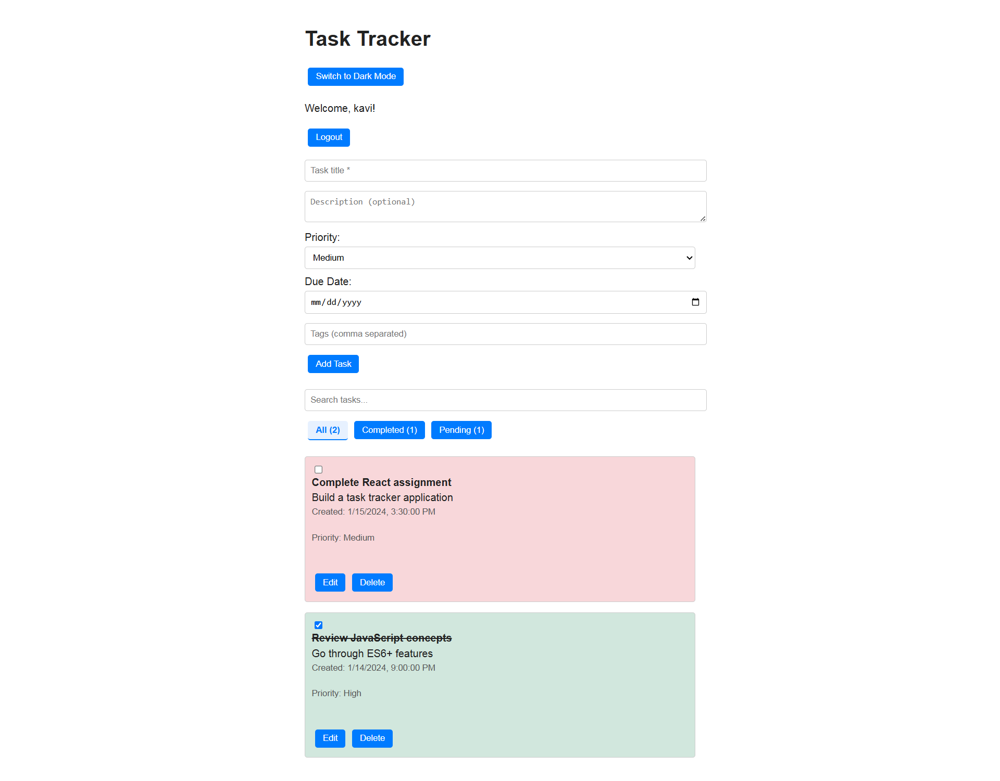

# Personal Task Tracker

## 📖 Description
A simple personal task tracker built with React. Users can log in with a username, add/edit/delete tasks, mark them as completed, filter tasks, search, and enjoy dark mode.

## 🚀 Features
- Simple login with localStorage
- Add, edit, delete tasks
- Mark tasks as complete or pending
- Filter: All, Completed, Pending
- Task counts for each filter
- Search tasks
- Task priority & due date
- Dark mode toggle
- Tasks saved to localStorage

## 🛠 Setup Instructions
1. Clone the repository  
   `git clone https://github.com/kavi-004/personal-task-tracker.git`
2. `cd personal-task-tracker`
3. `npm install`
4. `npm start`
5. Open [http://localhost:3000](http://localhost:3000)

## 🧰 Technologies Used
- React.js
- LocalStorage

## 🔗 Live Demo
https://personal-task-tracker-git-main-kavindyas-projects-4a97af22.vercel.app

## 🖼 Screenshots

